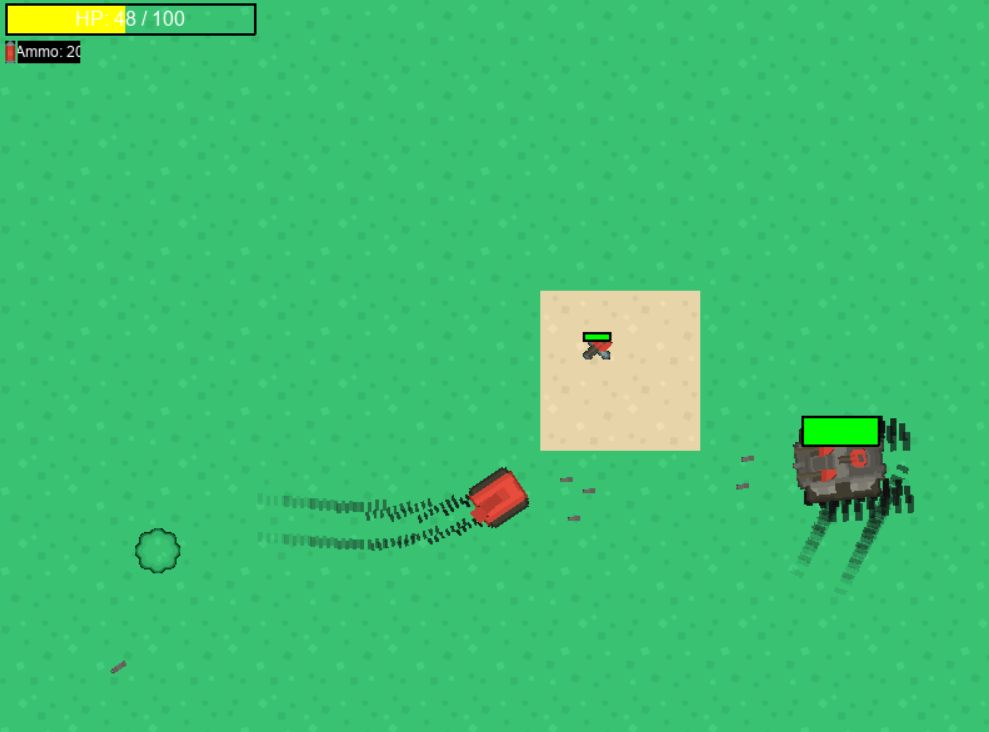

# Blast Zone

A 2D topdown tank game application.

# Sample Image



## Description

Blast Zone is a python game application made with pygame in which a player can control a tank with their mouse and keyboard.

### Player Tank

The player tank moves using WASD. In particular, `W` moves forward, `S` moves backward,
and `A` and `D` are used to turn. The mouse can be used to point in the direction
that a player wants to shoot, and the player can left click to actually shoot.

### Enemies

One of three enemies spawns at the beginning of the game, which the player must defeat. The enemy tank will patrol around a predefined path by default, but will pursue the player if they're within a certain distance. Once they've run out of bullets, the enemy tank will flee. The player must defeat this tank to win the game.

A turret is also present, which will attack the player (but can also hurt the enemy tank) if they're close enough. The turret has a cooldown on its attack.

### Items

A player can break boxes to obtain simple power ups, such as a short speed boost, bullet reloading, and a health pack.

## Installation

```
pip install -r requirements.txt
```

## Usage

```
py -3 main.py
```

## Authors and Acknowledgement

- Sergio Garcia (myself).
- Sam J. Dedes (@samjdedes).
- All graphics from Kenney's redux topdown pack at https://kenney.nl/.
- Map developed using the [Tiled Map Editor](https://www.mapeditor.org/).
- Souds generated with https://www.bfxr.net/.

The [KidsCanCode](https://www.youtube.com/watch?v=VO8rTszcW4s&list=PLsk-HSGFjnaH5yghzu7PcOzm9NhsW0Urw) was a main source of information for learning pygame, aside from the docs. Other great ideas were drawn from the book _Game Programming Algorithms and Techniques_ by Sanjay Madhav, a great book to have in your shelf if you want to learn about game development.

## Project Status

Though this project was declared as finished around a year ago, I have been wanting to restart development on it. Some of the things I want to do are included in the following (non-exhaustive) list:

- Refactoring in general.
- Include more maps and levels.
- Custom game splash (as opposed to using Kenney's splash).
